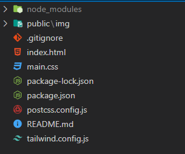

# (a.) Learn Vite Server & Deployment for `Tailwindcss` :

## 🪜 Step 1:

```css
npm i vite
```

## 🪜 Step 2: In _package.json_ file add below code

- Add `"start": "vite"` inside `"scripts"`

```css
{
    "scripts": {
        "start": "vite"
  },


  "dependencies": {
      "vite": "^4.4.9"
  }
}

```

## 🪜 Step 3: Execution

```css
npm run start
```
`or`
```css
npm run start -- --host
```

---

# (b.) Deployment of vite + Tailwind Project :

### `Note:` Folder arrangement must be according to below rules : ⬇️

- 

- For Images create folder like this
  - public/img/ ...
  - public/img/pic-1.webp
  - public/img/pic-2.png

## 🪜 Step 1: In `package.json` file add below code :
FileName: `package.json`
```css
{
    "scripts": {
        "build": "vite build",
    "preview": "vite preview"
  }
}
```

## 🪜 Step 2: 
```
npm run build
```

- Then `📂dist` named folder will be created.

## 🪜 Step 3: Add `./` prefix before `img src` and `link src`

### 3.1 `link` html tag :
```html
  <link rel="stylesheet" href="/assets/index-45e4d841.css"> <!-- 💀 ❌ -->
```

```html
  <link rel="stylesheet" href="./assets/index-45e4d841.css"> <!-- ✅ -->
```
---
### 3.2 `img` html tag :
```html
 <!-- 💀 ❌ -->
```

```html
 <!-- ✅ -->
```

